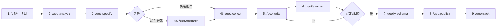

# Geoify - AI 引用优化工具

[](https://www.npmjs.com/package/geoify)
[](LICENSE)
[](https://nodejs.org/)
[](https://github.com/wordflowlab/geoify/actions/workflows/test.yml)
[](COVERAGE_REPORT.md)
[](TEST_SUMMARY.md)
[](CONTRIBUTING.md)

> Optimize for AI Citation, Not Just Search Ranking

**Geoify** 是一款专注于 GEO (Generative Engine Optimization) 的 AI 内容工具,帮助你的内容成为 ChatGPT、Perplexity、Claude 等 AI 引擎的引用来源。

## 什么是 GEO?

GEO (Generative Engine Optimization / 生成引擎优化) 是一种新兴的内容优化策略:

- **SEO**: 优化内容在搜索引擎(Google/百度)中的**排名**
- **GEO**: 优化内容使其成为 AI 引擎的**引用来源**

### 典型场景

```
用户向 ChatGPT 提问: "2024年最值得学习的编程语言是什么?"

传统搜索 (SEO):
→ 返回 10 个网页链接
→ 用户需要点击并阅读

AI 搜索 (GEO):
→ AI 直接生成答案
→ 在答案中引用你的内容 ⭐
→ 示例: "根据 XXX 网站的数据,Python 在 2024 年..."
```

## 核心特性

### ✅ 继承 scriptify (article-writer)

- 🎓 **多模式写作** - 教练/快速/混合模式,确保内容真实性
- 📚 **素材库管理** - 导入真实数据/案例,建立可信来源
- ✨ **真实性审校** - 三遍审校,降低 AI 味
- 💻 **斜杠命令系统** - 支持 13 个 AI 平台(Claude/Cursor/Gemini 等)

### 🆕 GEO 专属功能

- 📊 **E-E-A-T 评分** - Google 质量标准评估
- 🔗 **引用格式优化** - 结构化数据、权威引用
- 📈 **AI 引用跟踪** - 监测在各 AI 平台的引用情况
- 🎯 **竞争分析** - 分析竞品在 AI 答案中的表现

## 快速开始

### 🚀 10 分钟快速体验

**最快上手方式** → [QUICKSTART.md](QUICKSTART.md)

从分析到发布,10 分钟走完完整流程!

### 安装

```bash
npm install -g geoify
```

### 完整工作流 (9 步)



### 命令列表

**在 AI 助手中使用** (Claude Code / Cursor / Gemini 等):

```
/geo.analyze   - 分析 GEO 现状和机会
/geo.specify   - 定义内容目标
/geo.research  - 研究竞争对手 (可选)
/geo.collect   - 收集真实素材
/geo.write     - 生成内容草稿
/geo.publish   - 发布准备
/geo.track     - 跟踪 AI 引用
```

**在终端使用**:

```bash
# 初始化项目
geoify init my-article

# E-E-A-T 评分
geoify review article/draft.md

# 生成 Schema.org
geoify schema article/final.md \
  --url "https://example.com/article" \
  --site-name "My Blog"
```

## E-E-A-T 原则

Geoify 遵循 Google 的 E-E-A-T 质量标准:

| 维度 | 全称 | GEO 要求 |
|-----|------|---------|
| **E** | Experience | 内容基于**亲身经历**,非编造 |
| **E** | Expertise | 展示**专业知识**和技能 |
| **A** | Authoritativeness | 引用**权威来源**,有外部认可 |
| **T** | Trustworthiness | 数据**可验证**,透明联系方式 |

## 支持的 AI 平台

### 目标 AI 引擎

- ✅ **ChatGPT** (OpenAI)
- ✅ **Perplexity** (答案引擎)
- ✅ **Claude** (Anthropic)
- ✅ **Gemini** (Google)
- ✅ **文心一言** (百度)
- ✅ **通义千问** (阿里)

### 支持的 AI 工具(斜杠命令)

| AI 工具 | 命令格式 | 示例 |
|---------|----------|------|
| **Claude Code** | `/geo.命令名` | `/geo.write` |
| **Gemini CLI** | `/geo:命令名` | `/geo:write` |
| **Cursor** | `/命令名` | `/geo-write` |
| **其他平台** | `/命令名` | `/geo-write` |

## 项目结构

```
my-article/
├── .geoify/              # 配置与脚本
│   ├── config.yaml       # 项目配置
│   └── templates/        # 命令模板
├── .claude/commands/     # Claude 命令
├── .cursor/commands/     # Cursor 命令
├── _analysis/            # GEO 分析报告
├── _tracking/            # AI 引用跟踪数据
├── _knowledge_base/      # 调研结果
├── materials/            # 素材库
│   ├── raw/              # 原始数据
│   ├── indexed/          # 主题索引
│   └── archive/          # 历史文章
├── profile/              # 内容配置
│   └── schema/           # Schema.org 标记
└── articles/             # 文章输出
    └── 001-topic/
        ├── draft.md
        └── final.md
```

## 评分标准

| 总分 | 评级 | AI 引用概率 | 预期效果 |
|------|------|-----------|---------|
| **9.0-10** | 优秀 | 80-95% | 2-4 周内被引用 |
| **8.5-8.9** | 良好 | 70-80% | 4-6 周内被引用 |
| **8.0-8.4** | 及格 | 60-70% | 6-8 周内被引用 |
| **7.0-7.9** | 需优化 | 45-60% | 需要优化 |
| **< 7.0** | 不达标 | < 45% | 必须优化 |

## 文档

### 快速导航

| 文档 | 描述 | 适合人群 |
|------|------|---------|
| [**QUICKSTART.md**](QUICKSTART.md) | 10 分钟快速体验 | 新用户 |
| [**USAGE.md**](USAGE.md) | 完整使用手册 | 所有用户 |
| [**CHANGELOG.md**](CHANGELOG.md) | 版本更新记录 | 所有用户 |
| [**README.md**](README.md) | 项目总览 (本文档) | 所有用户 |

### 开发文档
- [完整 PRD](docs/PRD.md) - 产品需求文档
- [实施路线图](docs/ROADMAP.md) - 开发计划
- [技术架构](docs/ARCHITECTURE.md) - 架构设计

## 与 scriptify 的关系

Geoify 基于 [scriptify (article-writer)](https://github.com/wordflowlab/scriptify) 的架构开发,专注于 GEO 优化:

| 项目 | 定位 | 核心功能 |
|-----|------|---------|
| **scriptify** | 自媒体写作工具 | 多模式写作 + 降 AI 味 |
| **geoify** | GEO 优化工具 | E-E-A-T 评分 + AI 引用跟踪 |

## 路线图

### v0.1.0-alpha.3 (当前版本) ✨

- [x] 项目初始化
- [x] E-E-A-T 评分系统
- [x] `geoify review` - E-E-A-T 审校命令
- [x] `geoify schema` - Schema.org 生成命令
- [ ] 示例项目和完整文档

### v0.1.0 (MVP)

- [ ] `/geo-write` 命令实现
- [ ] 引用格式优化
- [ ] 完整测试覆盖

### v0.2.0 (Beta) - 3 周

- [ ] AI 引用跟踪
- [ ] 竞争分析
- [ ] `/geo-track` 命令
- [ ] `/geo-analyze` 命令

### v0.3.0 (正式版) - 3 周

- [ ] API 集成
- [ ] 数据看板
- [ ] 多行业模板

## 贡献

欢迎提交 Issue 和 Pull Request!

## 许可证

MIT License

## 致谢

- 基于 [scriptify (article-writer)](https://github.com/wordflowlab/scriptify) 架构
- 灵感来自论文: [GEO: Generative Engine Optimization](https://arxiv.org/abs/2311.09735)

---

**让你的内容成为 AI 时代的权威来源!** ✨
