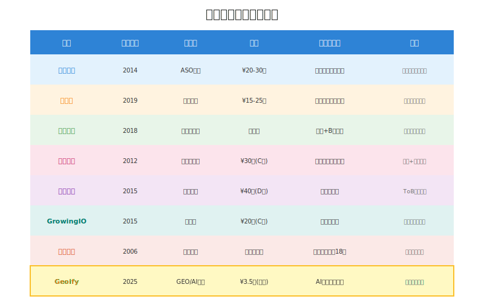
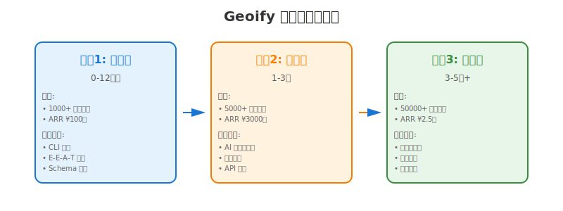
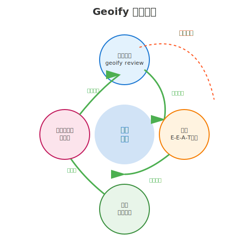
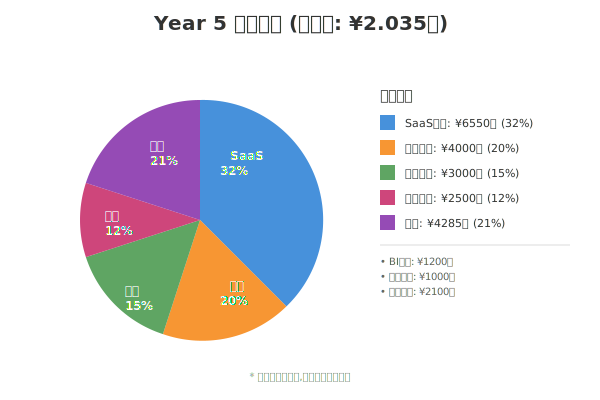

# Geoify 商业模式探讨:从数据洞察到行业生态

> **对标研究**:七麦数据 × 蝉妈妈 — 如何从新兴行业的数据切入点成长为头部平台
>
> **战略规划**:Geoify 如何在 GEO(生成引擎优化)赛道复制这一成功路径

---

## 文档信息

- **创建日期**: 2025-11-03
- **版本**: v1.0.0
- **目标读者**: 创始团队、潜在投资人、战略合作伙伴
- **时间跨度**: 2025-2030+(全生命周期规划)

---

## 目录

1. [标杆案例深度解析](#一标杆案例深度解析)
2. [GEO 行业机会分析](#二geo-行业机会分析)
3. [Geoify 全周期商业战略](#三geoify-全周期商业战略)
4. [数据变现路径设计](#四数据变现路径设计)
5. [生态建设与护城河](#五生态建设与护城河)
6. [融资与资本策略](#六融资与资本策略)
7. [风险与应对](#七风险与应对)
8. [总结与行动计划](#八总结与行动计划)

---

## 一、标杆案例深度解析

### 1.1 七麦数据:从 ASO 工具到移动应用生态入口

#### 背景与切入时机

**成立时间**: 2014年左右
**切入点**: App Store 和 Google Play 应用数据分析

**时机选择的精准性**:
- 2014-2015年正值移动互联网爆发期
- App 数量激增,开发者急需 ASO(应用商店优化)工具
- 传统 SEO 工具无法解决移动应用的搜索优化问题

#### 核心产品与技术壁垒

**产品线演进**:

| 阶段 | 核心产品 | 技术壁垒 | 目标用户 |
|-----|---------|---------|---------|
| **1.0 工具期** | ASO 数据查询工具 | 全量应用数据爬取 | 独立开发者 |
| **2.0 平台期** | 关键词优化 + 竞品分析 | ASO 优化算法 | 中小企业、代理商 |
| **3.0 生态期** | Apple Ads 优化 + 数据报告 | 广告投放算法 + 行业数据库 | 大型企业、品牌主 |

**数据壁垒的建立**:
1. **覆盖度**: 双平台(iOS + Android)全量数据
2. **颗粒度**: 实时排名、关键词热度、下载量估算
3. **独家性**: ASO 优化效果评估算法
4. **时效性**: 每日更新,历史数据可追溯

#### 商业模式演进

**收入结构**(推测):

```
工具期(2014-2016):
→ 100% SaaS 订阅收入
→ 分层定价:免费版 + 基础版(¥299/月)+ 专业版(¥999/月)

平台期(2017-2019):
→ 60% SaaS 订阅
→ 30% 企业定制服务(竞品分析报告、行业研究)
→ 10% 广告收入

生态期(2020-现在):
→ 40% SaaS 订阅
→ 35% Apple Ads 优化服务(按效果分成)
→ 15% 数据API接口
→ 10% 行业报告 + 峰会活动
```

**关键转折点**:
- **2017年**: 推出 Apple Search Ads 优化服务,从"数据工具"升级为"增长服务"
- **2019年**: 建立服务商网络,从"自营服务"扩展到"生态平台"

#### 护城河分析

**七麦的三重护城河**:

1. **数据网络效应**
   - 用户越多 → 行业数据越丰富 → 基准数据越准确 → 吸引更多用户
   - 类比:七麦 = 移动应用领域的"艾瑞咨询"

2. **客户迁移成本**
   - 历史数据积累(3-5年的 ASO 跟踪记录)
   - 优化策略依赖(算法黑盒,难以复制)
   - 团队协作成本(多账号管理、权限体系)

3. **行业标准制定权**
   - 发布《移动应用 ASO 白皮书》
   - 举办行业峰会,建立话语权
   - 成为投资人尽调的必用工具

---

### 1.2 蝉妈妈:抓住直播电商风口的数据平台

#### 背景与切入时机

**成立时间**: 2019年左右
**切入点**: 抖音直播电商数据分析

**时机选择的天才之处**:
- 2019年抖音直播带货刚刚兴起(李佳琦、薇娅走红)
- 传统电商数据工具(生意参谋)无法覆盖短视频平台
- 品牌和 MCN 对直播数据有强烈需求但无工具可用

**为什么是抖音而非淘宝?**
- 淘宝数据被阿里垄断(生意参谋)
- 抖音数据开放度更高(前端可抓取)
- 新兴平台规则未定,容易建立先发优势

#### 核心创新与差异化

**蝉妈妈的"首创"策略**:

| 创新点 | 说明 | 商业价值 |
|-------|-----|---------|
| **直播间停留时间** | 行业首创指标 | 评估内容质量的核心维度 |
| **转化率分析** | 商品点击到成交的漏斗 | 帮助优化直播话术和商品排序 |
| **平均UV价值** | 单个观众的价值评估 | 精准计算广告投放ROI |
| **小店数据** | 抖音小店排行榜 | 帮助品牌选择合作达人 |
| **网页端+App同步** | 多端数据互通 | 提升使用便利性 |

**技术壁垒**:
1. **数据采集**: 抖音反爬虫对抗能力
2. **数据清洗**: 刷量、虚假数据识别
3. **算法模型**: 销量估算、GMV预测
4. **实时性**: 直播数据近实时更新(延迟<10分钟)

#### 商业模式演进

**收入结构**(推测):

```
工具期(2019-2020):
→ 100% SaaS 订阅
→ 定价: 基础版¥299/月 + 专业版¥999/月 + 企业版¥2999/月

平台期(2021-2022):
→ 50% SaaS 订阅
→ 30% 行业报告(《美妆行业直播电商报告》等,单份¥5000-50000)
→ 20% 企业定制服务(竞品分析、达人推荐)

生态期(2023-现在):
→ 40% SaaS 订阅
→ 25% AI 赋能服务(AI笔记助手、数字人等)
→ 20% 行业活动(论坛门票、品牌赞助)
→ 15% 数据 API + 企业定制
```

**关键转折点**:
- **2020年**: 抖音电商GMV破5000亿,蝉妈妈成为刚需工具
- **2021年**: 推出"达人诊断"服务,从数据到咨询
- **2023年**: AI元年,推出 AI 笔记助手,升级为"AI+数据"双引擎

#### 快速崛起的秘诀

**蝉妈妈 vs 传统数据工具的差异**:

| 维度 | 传统工具(如生意参谋) | 蝉妈妈 |
|-----|-----------------|-------|
| **平台覆盖** | 淘宝/天猫 | 抖音/小红书(新兴平台) |
| **数据颗粒度** | 店铺级 | 直播间级 + 达人级 |
| **更新频率** | T+1(次日) | 近实时(10分钟) |
| **核心指标** | 销量、转化率 | 停留时间、UV价值(新指标) |
| **服务模式** | 纯工具 | 工具 + 行业研究 + AI赋能 |

**用户粘性的建立**:
1. **数据依赖**: 品牌每日必看直播数据
2. **决策依赖**: 基于数据选择合作达人
3. **学习依赖**: 行业报告和趋势洞察
4. **成本依赖**: 历史数据积累(1-2年的直播记录)

---

### 1.3 成功路径共性总结

通过对比七麦和蝉妈妈,我们提炼出**从数据工具到行业生态**的五大共性:

#### 共性 1:精准的时机选择

**新兴平台早期切入 = 最大化先发优势**

| 公司 | 切入时间 | 平台阶段 | 窗口期 |
|-----|---------|---------|-------|
| 七麦 | 2014年 | App Store 爆发期 | 2-3年独占 |
| 蝉妈妈 | 2019年 | 抖音直播起步期 | 1-2年独占 |

**窗口期的特征**:
- ✅ 平台用户增长迅速(年增长>100%)
- ✅ 官方数据工具缺失或不成熟
- ✅ 用户对数据有强需求但无工具可用
- ✅ 数据获取技术门槛较低(前端可爬取)

#### 共性 2:独家数据指标建立权威

**"行业首创"的指标 = 定义游戏规则**

**七麦的独家指标**:
- ASO 优化效果评分
- 应用热度指数
- 关键词竞争难度

**蝉妈妈的独家指标**:
- 直播间平均停留时间
- 转化率
- 平均UV价值

**为什么独家指标重要?**
1. **建立行业话语权**: 用户用你的指标体系思考问题
2. **形成数据壁垒**: 竞品无法直接复制
3. **增加迁移成本**: 切换工具 = 重新学习指标体系

#### 共性 3:从"工具"到"决策依赖"

**用户关系演进**:

```
阶段1:偶尔使用的工具
→ 用户:每周查1-2次数据
→ 付费意愿:低(¥99/月)

阶段2:每日必用的平台
→ 用户:每天查看竞品动态
→ 付费意愿:中(¥299-999/月)

阶段3:战略决策的依据
→ 用户:基于数据制定全年计划
→ 付费意愿:高(¥2999+/月,甚至年费数十万)
```

**如何从工具变成决策依据?**
- **历史数据积累**: 保存3-5年的数据,成为"时光机"
- **行业基准对比**: "你的数据 vs 行业Top 10%"
- **趋势预测**: 基于历史数据预测未来
- **咨询服务**: 从"给你数据"到"告诉你怎么做"

#### 共性 4:数据 → 服务 → 生态的扩张路径

**三级火箭模型**:

```
第一级:工具产品(获客)
→ 低价/免费吸引用户
→ 建立数据网络效应
→ 目标:10万+ 用户

第二级:增值服务(变现)
→ 企业定制报告
→ 广告优化服务
→ 咨询培训
→ 目标:客单价 ×10

第三级:生态平台(壁垒)
→ 服务商网络(七麦的代理商)
→ 行业联盟(蝉妈妈的MCN合作)
→ 标准制定(白皮书、峰会)
→ 目标:成为行业基础设施
```

**案例:七麦的生态扩张**
- **2014-2016**: 纯ASO工具
- **2017-2019**: 增加 Apple Ads 优化服务
- **2020-现在**: 建立代理商网络,从自营到平台

**案例:蝉妈妈的生态扩张**
- **2019-2020**: 纯数据工具
- **2021-2022**: 行业报告 + MCN合作
- **2023-现在**: AI赋能 + 行业峰会

#### 共性 5:建立"数据飞轮"

**数据飞轮模型**:

```
更多用户
    ↓
更多数据采集
    ↓
更准确的行业基准
    ↓
更有价值的洞察
    ↓
吸引更多用户 (循环加速)
```

**七麦的飞轮**:
- 用户上传 ASO 优化数据 → 七麦改进算法 → 提供更好的优化建议 → 吸引更多用户

**蝉妈妈的飞轮**:
- 品牌查询直播数据 → 蝉妈妈积累行业基准 → 发布行业报告 → 吸引更多品牌

**飞轮的启动条件**:
1. **种子用户**(1000+付费用户)
2. **独家数据**(竞品无法获取)
3. **正向反馈**(用户使用 → 数据价值↑)

---

### 1.4 对 Geoify 的启示

基于七麦和蝉妈妈的成功经验,Geoify 的战略方向应该是:

| 维度 | 七麦/蝉妈妈的做法 | Geoify 的应用 |
|-----|---------------|-------------|
| **时机** | 新平台早期切入 | GEO 群雄并起期,现在是最佳窗口 |
| **独家指标** | ASO评分、停留时间 | **E-E-A-T评分、AI引用率** |
| **用户依赖** | 历史数据积累 | **AI引用跟踪、内容评分历史** |
| **服务扩展** | 广告优化、咨询 | **GEO咨询、内容优化服务** |
| **生态建设** | 代理商、MCN | **GEO服务商网络、内容创作者联盟** |
| **数据飞轮** | 行业基准 | **各行业GEO优化基准库** |

**核心差异化**:
- 七麦 = App Store 数据垄断
- 蝉妈妈 = 抖音直播数据垄断
- **Geoify = AI 引用数据垄断(ChatGPT/Perplexity/Claude/Gemini)**

---

### 1.5 更多国内数据公司速览

除了七麦和蝉妈妈,中国还有多个通过数据切入垂直行业并成功的案例,值得 Geoify 参考:

| 公司 | 成立 | 切入点 | 估值/退出 | 核心差异化 | 启示 |
|-----|------|-------|----------|-----------|------|
| **飞瓜数据** | 2018 | 抖音/快手电商 | 未披露 | 多平台覆盖(快手+B站) | 即使晚入场,差异化策略也能占据市场 |
| **易观数据** | 2012 | 移动互联网 | ¥30亿(C轮) | 最早入场,持续创新 | 先发优势+产品迭代 |
| **神策数据** | 2015 | 用户行为分析 | ¥40亿(D轮) | 私有化部署,ToB高客单价 | 企业级市场客单价高但销售周期长 |
| **GrowingIO** | 2015 | 无埋点分析 | ¥20亿(C轮) | "无埋点"技术(行业首创) | 技术创新降低使用门槛 |
| **艺恩数据** | 2006 | 影视票房数据 | 被万达收购 | 垂直行业深耕18年 | 战略收购是重要退出路径 |

**七大数据公司对比矩阵**:



**关键洞察**:

1. **时机多样性**: 既有先发优势(易观2012),也有后发制人(飞瓜2018 vs 蝉妈妈2019)
2. **ToB vs ToC**: 神策(企业级,¥50万+/年) vs 蝉妈妈(中小客户,¥999/月)
3. **技术创新**: GrowingIO 的"无埋点"技术证明技术壁垒的重要性
4. **退出多元**: IPO规划(易观) vs 战略收购(艺恩被万达收购)
5. **市场定位**: 垂直深耕(艺恩专注影视) vs 多平台(飞瓜覆盖抖音+快手+B站)

**对 Geoify 的启示**:
- ✅ 时间窗口仍在(GEO行业2025年仍处早期)
- ✅ 可以借鉴 ToC 低价高频(蝉妈妈) + ToB 高价低频(神策)的组合策略
- ✅ 技术创新(E-E-A-T评分算法)可以成为护城河
- ✅ 保持退出路径灵活性(IPO or 被AI平台收购)

---

## 二、GEO 行业机会分析

### 2.1 市场现状:传统 SEO 的末日,GEO 的黎明

#### 数据驱动的行业变革

**传统搜索的崩塌**:

| 指标 | 2023年 | 2024年 | 变化 |
|-----|-------|-------|-----|
| Google 搜索市场份额 | 92% | 89% | **↓3%** |
| 无点击搜索比例 | 25% | 58% | **↑132%** |
| SEO效能(转化率) | 基准100 | 37 | **↓63%** |
| AI工具月活用户 | 1亿 | 3亿+ | **↑200%** |

**来源**: 《2024年中国AI搜索生态发展白皮书》、Gartner 预测

**用户行为的根本性转变**:

```
传统搜索路径(2023年):
用户搜索 → Google返回10个链接 → 点击阅读 → 对比 → 决策
平均耗时:15-30分钟

AI搜索路径(2024年):
用户提问 → AI直接给答案(附引用) → 决策
平均耗时:2-5分钟

效率提升:6-10倍
```

**Gartner 关键预测**:
> "到 2026 年,传统搜索引擎的数量将下降 **25%**,AI 聊天机器人和其他虚拟代理将抢占搜索营销的市场份额。"

#### GEO 市场规模测算

**自上而下测算**(TAM → SAM → SOM):

```
TAM(总市场):
→ 全球 SEO 市场规模:800亿美元(2024)
→ 预计30%转向 GEO:240亿美元(2026)

SAM(可服务市场):
→ 中国 GEO 市场:240亿 × 20% = 48亿美元
→ 其中 SaaS 工具市场:48亿 × 15% = 7.2亿美元

SOM(可获得市场):
→ Geoify 5年目标市场份额:7.2亿 × 5% = 3600万美元
→ 约合人民币 2.5亿元
```

**自下而上测算**(用户量 × ARPU):

```
目标用户群(中国市场):
→ 内容创作者/博主:50万人
→ 企业/品牌:10万家
→ SEO/营销从业者:20万人
→ 总计:80万潜在用户

渗透率与ARPU:
→ 5年渗透率:10%(8万付费用户)
→ 平均ARPU:¥3000/年
→ 年收入:8万 × ¥3000 = 2.4亿元
```

**两种测算接近,验证了 2.5 亿元年收入的可行性**

---

### 2.2 竞争格局:群雄并起,无明显头部

#### 国内 GEO 服务商分析

基于搜索结果,2025年国内主要GEO服务商包括:

| 服务商 | 类型 | 优势 | 劣势 |
|-------|-----|-----|-----|
| **武汉当夏科技** | 咨询+服务 | 技术研发实力 | 无标准化工具产品 |
| **欧博东方文化传媒** | 内容营销 | 内容生产能力 | 数据能力弱 |
| **质安华GNAGroup** | 企业服务 | 大客户资源 | 缺少长尾市场覆盖 |
| **哈耶普斯广告** | 广告代理 | 广告投放经验 | GEO专业度不足 |
| **聚焦网络/零壹思维** | SEO转型 | SEO客户基础 | 思维惯性,难以转型 |

**行业特征**:
- ❌ **无工具化产品**: 以人工咨询为主,难以规模化
- ❌ **无数据积累**: 缺少AI引用跟踪数据
- ❌ **无标准化**: 每个项目都是定制化,交付不稳定
- ❌ **客单价高但天花板低**: 依赖人力,年收入难超5000万

**这正是 Geoify 的机会窗口!**

#### 国际竞争对手分析

**传统 SEO 工具的转型尝试**:

| 工具 | GEO 功能 | 评估 |
|-----|---------|-----|
| **Surfer SEO** | 部分 E-E-A-T 检查 | ⚠️ 功能薄弱,无 AI 引用跟踪 |
| **Clearscope** | 内容优化建议 | ⚠️ 仍基于传统关键词思维 |
| **MarketMuse** | 权威性评估 | ✅ 有E-E-A-T,但无中文支持 |
| **Semrush** | 计划推出 GEO 模块 | ⚠️ 2025年才上线,进度慢 |

**国际工具的短板**:
1. **中文支持差**: E-E-A-T 评估基于英文语料
2. **AI 平台覆盖少**: 主要针对 ChatGPT,忽略百度文心、阿里通义
3. **价格高**: $89-170/月,中国用户难以接受

**Geoify 的差异化**:
- ✅ **中文原生**: E-E-A-T 评估针对中文内容优化
- ✅ **全 AI 平台**: 覆盖 ChatGPT/Perplexity/Claude/Gemini/文心/通义
- ✅ **价格友好**: ¥99/月,仅为国际工具的 1/6

---

### 2.3 市场空白与机会

#### 空白 1:标准化的 GEO 评估工具

**现状**:
- 国内GEO服务商:人工评估,无统一标准
- 企业困境:不知道自己内容的GEO得分是多少

**Geoify 的解决方案**:
- ✅ **自动化 E-E-A-T 评分** (geoify review)
- ✅ **10分制标准化评估**
- ✅ **可视化报告** + 优化建议

**参照**:
- 七麦的 ASO 评分 → Geoify 的 E-E-A-T 评分
- 蝉妈妈的直播间诊断 → Geoify 的内容诊断

#### 空白 2:AI 引用跟踪数据

**现状**:
- 无人系统化收集 AI 引用数据
- 企业不知道自己被 AI 引用了多少次
- 行业无基准数据

**Geoify 的机会**:
- ✅ **建立中国最大的 AI 引用数据库**
- ✅ **发布行业报告**: 《2025年 AI 引用趋势报告》
- ✅ **提供竞品对比**: "你的引用次数 vs 竞品"

**数据飞轮**:
```
用户跟踪引用
    ↓
Geoify 积累数据
    ↓
发布行业基准
    ↓
吸引更多用户
    ↓
数据价值↑(循环)
```

**参照**:
- 七麦的应用排名数据库 → Geoify 的 AI 引用数据库
- 蝉妈妈的直播GMV数据库 → Geoify 的内容引用数据库

#### 空白 3:GEO 知识库与最佳实践

**现状**:
- GEO 知识分散在博客、论文中
- 无系统化的学习路径
- 缺少行业案例库

**Geoify 的解决方案**:
- ✅ **GEO 大学**: 系统化课程(免费+付费)
- ✅ **案例库**: 高分文章拆解(类似蝉妈妈的"爆款案例库")
- ✅ **最佳实践指南**: 各行业 GEO 优化模板

**变现路径**:
- 免费内容获客(公开课、博客)
- 付费课程(¥999/人,年培训1000人 = ¥100万)
- 企业培训(¥5万/场,年20场 = ¥100万)

---

### 2.4 Geoify 的竞争优势矩阵

与国内外竞争对手的全方位对比:

| 维度 | 国内服务商 | 国际工具 | **Geoify** |
|-----|----------|---------|----------|
| **工具化** | ❌ 人工咨询为主 | ✅ 自动化工具 | ✅ CLI + 斜杠命令 |
| **E-E-A-T评分** | ⚠️ 无标准 | ✅ 有,但英文 | ✅ 中文优化 |
| **AI引用跟踪** | ❌ 无 | ❌ 无 | ✅ **独家** |
| **llms.txt支持** | ❌ 无 | ⚠️ 部分 | ✅ 自动生成 |
| **中文支持** | ✅ 是 | ❌ 否 | ✅ 原生中文 |
| **AI平台覆盖** | ⚠️ ChatGPT为主 | ⚠️ ChatGPT为主 | ✅ 6+ 平台 |
| **价格** | ¥5000+/项目 | $89-170/月 | ¥99/月 |
| **开源** | ❌ 否 | ❌ 否 | ✅ **开源+商业** |
| **数据积累** | ❌ 无 | ⚠️ 少 | ✅ **建立数据库** |

**核心差异化总结**:
1. **唯一提供 AI 引用跟踪的工具**
2. **唯一建立 GEO 数据库的平台**
3. **唯一开源的 GEO 工具**(社区驱动)
4. **性价比最高**(¥99 vs $89-170)

---

## 三、Geoify 全周期商业战略(2025-2030+)

### 3.1 战略总览:三阶段演进路径



**演进路径**:

```
阶段1: 工具期(0-12个月)
→ 目标:验证 PMF,建立口碑
→ 核心:开源工具 + 付费订阅
→ 里程碑:1000+ 付费用户,10万美元 ARR

阶段2: 平台期(1-3年)
→ 目标:成为 GEO 数据权威
→ 核心:AI 引用数据库 + 行业报告
→ 里程碑:5万+ 用户,500万美元 ARR

阶段3: 生态期(3-5年+)
→ 目标:定义行业标准,建立生态
→ 核心:服务商网络 + 认证体系
→ 里程碑:50万+ 用户,5000万美元 ARR
```

---

### 3.2 阶段1:工具期(2025年,0-12个月)

#### 战略目标

**产品目标**:
- [ ] 发布 v1.0 正式版
- [ ] E-E-A-T 评分准确率 >85%
- [ ] Schema.org 生成覆盖 5+ 类型
- [ ] llms.txt 自动生成功能

**用户目标**:
- [ ] 1000+ 付费用户(Pro版)
- [ ] 10000+ 免费用户
- [ ] 50+ 企业客户(Team版)
- [ ] NPS > 40

**收入目标**:
- [ ] ARR: ¥100万(约 $14万)
- [ ] 付费转化率: 10%
- [ ] 月均新增用户: 1000人

#### 核心产品

**免费版 (Free)**:

```yaml
功能:
  - ✅ geoify init (项目初始化)
  - ✅ geoify review (E-E-A-T评分,每月3次)
  - ✅ geoify schema (基础 Schema 生成)
  - ❌ 无 AI 引用跟踪
  - ❌ 无竞品分析

限制:
  - 1 个项目
  - 每月 3 次评分
  - 无历史数据

定价: ¥0
```

**专业版 (Pro)** - 核心变现产品:

```yaml
功能:
  - ✅ 所有 Free 功能
  - ✅ 无限次 E-E-A-T 评分
  - ✅ 5 个项目
  - ✅ 完整 Schema.org 支持
  - ✅ llms.txt 自动生成
  - ✅ AI 引用跟踪(每周更新)
  - ✅ 历史数据保留(1年)
  - ✅ 竞品对比(3个竞品)
  - ✅ 优先技术支持

定价: ¥99/月 或 ¥999/年(节省17%)
```

**团队版 (Team)**:

```yaml
功能:
  - ✅ 所有 Pro 功能
  - ✅ 无限项目
  - ✅ 多成员协作(5-20人)
  - ✅ API 调用(1000次/月)
  - ✅ 自定义品牌(白标)
  - ✅ 专属客户经理
  - ✅ SLA 保障(99.9%)

定价: ¥499/月 或 ¥4999/年
```

#### 获客策略

**开源驱动增长**(参考 n8n、Supabase):

```
1. GitHub 开源 CLI 工具
   → 目标: 1000+ stars, 100+ contributors

2. 技术博客 + 案例研究
   → 每周 1 篇深度文章
   → SEO + 知乎/掘金同步

3. 免费工具病毒传播
   → "分享得会员"机制
   → 邀请 5 人 → 免费 1 个月 Pro

4. AI 社区渗透
   → Claude Code / Cursor 用户群
   → 提供斜杠命令模板
```

**内容营销矩阵**:

| 内容类型 | 发布频率 | 平台 | 目标 |
|---------|---------|-----|-----|
| **技术教程** | 每周1篇 | 官网博客 + 知乎 | SEO + 品牌 |
| **案例拆解** | 每月2篇 | 公众号 + 掘金 | 展示价值 |
| **行业报告** | 每季度1份 | PDF下载(邮箱换) | Lead Gen |
| **视频教程** | 每月1个 | B站 + YouTube | 扩大受众 |

#### 数据积累

**种子数据收集**(第1年):

```
目标数据规模:
→ 10000+ 篇文章的 E-E-A-T 评分
→ 1000+ 个网站的 llms.txt 生成记录
→ 500+ 个查询的 AI 引用跟踪数据

用途:
→ 训练 E-E-A-T 评分模型
→ 建立各行业基准数据
→ 发布《2025 GEO 白皮书》
```

#### 收入模型

**第1年收入预测**:

```
Q1 (2025.01-03):
→ 免费用户: 2000人
→ Pro用户: 50人 × ¥99/月 = ¥4,950/月
→ Team用户: 5家 × ¥499/月 = ¥2,495/月
→ 季度收入: (¥4,950 + ¥2,495) × 3 = ¥22,335

Q2 (2025.04-06):
→ Pro用户: 200人 → ¥19,800/月
→ Team用户: 15家 → ¥7,485/月
→ 季度收入: ¥81,855

Q3 (2025.07-09):
→ Pro用户: 500人 → ¥49,500/月
→ Team用户: 30家 → ¥14,970/月
→ 季度收入: ¥193,410

Q4 (2025.10-12):
→ Pro用户: 1000人 → ¥99,000/月
→ Team用户: 50家 → ¥24,950/月
→ 季度收入: ¥371,850

年度总收入: ¥669,450 (约 $95,000)
ARR: ¥1.2M (考虑年付折扣)
```

**成本结构**:

```
技术成本:
→ 云服务(AWS/阿里云): ¥10,000/月
→ AI API调用(OpenAI/Claude): ¥20,000/月
→ 合计: ¥30,000/月 = ¥360,000/年

人力成本(假设2人全职):
→ 技术负责人: ¥40,000/月
→ 产品/运营: ¥25,000/月
→ 合计: ¥65,000/月 = ¥780,000/年

营销成本:
→ 内容制作: ¥10,000/月
→ 广告投放: ¥20,000/月
→ 合计: ¥30,000/月 = ¥360,000/年

年度总成本: ¥1,500,000
净亏损: -¥300,000 (第1年投入期)
```

---

### 3.3 阶段2:平台期(2026-2027年,1-3年)

#### 战略目标

**产品升级**:
- [ ] AI 引用数据库(100万+ 引用记录)
- [ ] 行业基准数据(20+ 行业)
- [ ] GEO API 开放平台
- [ ] 移动端 App

**用户规模**:
- [ ] 50000+ 注册用户
- [ ] 5000+ 付费用户
- [ ] 500+ 企业客户
- [ ] 覆盖 10+ 行业

**收入目标**:
- [ ] ARR: ¥3000万(约 $430万)
- [ ] 毛利率: 70%+
- [ ] 实现盈亏平衡

#### 核心产品升级

**新增产品线**:

**1. Geoify Analytics (数据平台)**

```yaml
功能:
  - 📊 AI 引用排行榜(实时更新)
  - 📈 行业趋势分析
  - 🔍 竞品深度对比(10+ 竞品)
  - 📄 自定义报告生成
  - 🎯 GEO 机会发现引擎

定价:
  - Pro版包含基础功能
  - Analytics Add-on: +¥299/月
  - 企业版: ¥2999/月(无限查询)
```

**2. Geoify API (开发者平台)**

```yaml
能力:
  - E-E-A-T 评分 API
  - AI 引用查询 API
  - 行业基准数据 API
  - Webhook 通知

定价模型:
  - 按调用次数计费
  - ¥0.5/次评分
  - ¥1/次引用查询
  - 包年套餐: ¥10,000/年(10000次)
```

**3. Geoify Copilot (AI 助手)**

```yaml
功能:
  - AI 实时写作建议
  - E-E-A-T 优化提示
  - 竞品内容对比
  - 智能引用推荐

定价: ¥199/月(Pro附加)
```

#### 数据变现

**行业报告**(参考蝉妈妈):

| 报告类型 | 定价 | 年销量(预测) | 收入 |
|---------|-----|-----------|-----|
| **垂直行业报告** | ¥5,000/份 | 200份 | ¥100万 |
| **GEO趋势年报** | ¥10,000/份 | 100份 | ¥100万 |
| **企业定制报告** | ¥50,000/份 | 20份 | ¥100万 |

**年度总收入: ¥300万**

**数据API**(参考七麦):

```
客户类型:
→ 内容平台(Notion/飞书/语雀):集成 E-E-A-T 评分
→ CMS厂商(WordPress/Webflow):插件合作
→ AI 工具(Cursor/Claude Code):斜杠命令集成

定价模型:
→ 平台合作:年费 ¥10万 + 分成
→ 预计10家合作伙伴
→ 年收入: ¥100万
```

#### 生态初步建设

**GEO 服务商认证网络**:

```
模式:
1. Geoify 提供工具和培训
2. 服务商用工具服务企业客户
3. Geoify 收取工具订阅费 + 认证费

收入:
→ 认证费: ¥5,000/家 × 100家 = ¥50万
→ 工具订阅: ¥999/月 × 100家 = ¥120万/年
→ 合计: ¥170万/年
```

**GEO 大学(培训)**:

| 课程 | 定价 | 学员数(年) | 收入 |
|-----|-----|----------|-----|
| **GEO基础课** | ¥999 | 1000人 | ¥100万 |
| **GEO认证** | ¥2999 | 200人 | ¥60万 |
| **企业内训** | ¥5万/场 | 30场 | ¥150万 |

**年度总收入: ¥310万**

#### 第2-3年收入模型

**2026年(第2年)收入预测**:

```
SaaS 订阅:
→ Pro: 3000人 × ¥99/月 × 12 = ¥356万
→ Team: 200家 × ¥499/月 × 12 = ¥120万
→ Analytics: 500人 × ¥299/月 × 12 = ¥179万
→ 小计: ¥655万

数据产品:
→ 行业报告: ¥300万
→ API调用: ¥100万
→ 小计: ¥400万

生态收入:
→ 服务商网络: ¥170万
→ 培训课程: ¥310万
→ 小计: ¥480万

年度总收入: ¥1535万 (约 $220万)
```

**2027年(第3年)收入预测**:

```
SaaS 订阅: ¥655万 × 2 = ¥1310万
数据产品: ¥400万 × 2 = ¥800万
生态收入: ¥480万 × 2.5 = ¥1200万
年度总收入: ¥3310万 (约 $475万)
```

---

### 3.4 阶段3:生态期(2028-2030+年,3-5年)

#### 战略目标

**行业地位**:
- [ ] 中国最大的 GEO 数据平台
- [ ] 1000万+ AI 引用记录
- [ ] 制定行业标准(llms.txt 中国标准)
- [ ] 成为投资人尽调必用工具

**用户规模**:
- [ ] 500000+ 注册用户
- [ ] 50000+ 付费用户
- [ ] 5000+ 企业客户
- [ ] 500+ 认证服务商

**收入目标**:
- [ ] ARR: ¥2.5亿(约 $3500万)
- [ ] 净利润率: 30%+
- [ ] 估值: ¥10-20亿

#### 生态产品

**1. Geoify Enterprise (企业私有化部署)**

```yaml
功能:
  - 私有化部署(本地 + 云)
  - 自定义评分模型
  - 企业知识库集成
  - SSO + 权限管理
  - 专属服务器

定价: ¥50万/年起
目标客户: 大型企业、政府机构
预计50家客户 = ¥2500万/年
```

**2. Geoify Marketplace (服务市场)**

```yaml
模式:
  - 服务商入驻平台
  - 企业发布需求
  - Geoify 撮合交易,收取15%佣金

GMV预测(第5年):
  → 年GMV: ¥2亿
  → 平台佣金: ¥3000万
```

**3. Geoify Insights (BI平台)**

```yaml
功能:
  - 数据大屏
  - 高管仪表盘
  - 预测模型
  - 智能告警

定价: ¥999/月(企业附加)
预计1000家 = ¥1200万/年
```

#### 行业标准制定

**GEO 认证体系**:

```
认证等级:
→ GEO 助理工程师(初级): ¥999
→ GEO 工程师(中级): ¥2999
→ GEO 专家(高级): ¥9999

年认证人数(第5年):
→ 初级: 5000人 × ¥999 = ¥500万
→ 中级: 1000人 × ¥2999 = ¥300万
→ 高级: 200人 × ¥9999 = ¥200万
→ 合计: ¥1000万/年
```

**行业联盟**:

```
模式:
1. 发起"中国 GEO 联盟"
2. 联合 AI 平台(字节/百度/阿里)
3. 制定行业标准和白皮书
4. 举办年度峰会

收入:
→ 会员费: 100家 × ¥10万 = ¥1000万
→ 峰会门票: 2000人 × ¥2999 = ¥600万
→ 品牌赞助: ¥500万
→ 合计: ¥2100万/年
```

#### 第5年收入模型(2030年)

```
SaaS 订阅: ¥1310万 × 5 = ¥6550万
数据产品: ¥800万 × 5 = ¥4000万
企业私有化: ¥2500万
服务市场: ¥3000万
BI 平台: ¥1200万
认证培训: ¥1000万
行业联盟: ¥2100万

年度总收入: ¥2.035亿
净利润: ¥6000万(净利润率 30%)
```

---

## 四、数据变现路径设计

### 4.1 数据资产体系

Geoify 的核心资产是**数据**,类比:
- 七麦 = App 数据资产
- 蝉妈妈 = 直播数据资产
- **Geoify = GEO 数据资产**

#### 数据分类与价值

**数据资产金字塔**:

```
顶层:行业洞察(最高价值)
    ↑
    - GEO 趋势预测
    - 跨行业基准对比
    - AI 引用模式分析
    - 价值: ¥10万+/份报告

中层:聚合数据(中等价值)
    ↑
    - 各行业 E-E-A-T 基准
    - AI 引用排行榜
    - 竞品对比数据库
    - 价值: ¥1000-10000/次查询

底层:原始数据(基础价值)
    ↑
    - 单篇文章 E-E-A-T 评分
    - llms.txt 生成记录
    - Schema.org 模板
    - 价值: ¥99/月订阅
```

#### 数据积累路径

**5年数据积累计划**:

| 数据类型 | Year 1 | Year 3 | Year 5 |
|---------|-------|-------|-------|
| **E-E-A-T 评分** | 1万篇 | 50万篇 | 500万篇 |
| **AI 引用记录** | 5000条 | 50万条 | 1000万条 |
| **行业覆盖** | 5个 | 20个 | 50+个 |
| **网站覆盖** | 1000个 | 5万个 | 50万个 |

**数据获取方式**:

```
1. 用户贡献(90%):
   → 用户使用 geoify review → 评分数据
   → 用户跟踪引用 → AI 引用数据

2. 主动采集(10%):
   → 爬取头部网站的 llms.txt
   → 定期查询 AI 平台(测试引用情况)
```

---

### 4.2 变现路径矩阵

参考七麦和蝉妈妈的经验,Geoify 的数据变现路径包括:

#### 路径 1:工具订阅(基础变现)

**定价策略**:

| 版本 | 月付 | 年付 | 目标人群 | 转化率 |
|-----|-----|-----|---------|-------|
| Free | ¥0 | - | 尝试用户 | - |
| Pro | ¥99 | ¥999 | 个人/小团队 | 10% |
| Team | ¥499 | ¥4999 | 中小企业 | 5% |
| Enterprise | ¥2999+ | 定制 | 大型企业 | 1% |

**漏斗模型**:

```
Year 3 预测:
→ 注册用户: 50000人
→ Pro转化: 50000 × 10% = 5000人
→ Team转化: 50000 × 5% = 2500家
→ Enterprise: 50家

收入:
→ Pro: 5000 × ¥99 × 12 = ¥594万
→ Team: 2500 × ¥499 × 12 = ¥1497万
→ Enterprise: 50 × ¥50万 = ¥2500万
→ 合计: ¥4591万
```

#### 路径 2:数据产品(中等变现)

**产品矩阵**:

**a) 行业报告**(参考蝉妈妈):

| 报告名称 | 定价 | 制作成本 | 毛利率 | 年销量 |
|---------|-----|---------|-------|-------|
| 月度趋势报告 | ¥999 | ¥100 | 90% | 2000份 |
| 垂直行业深度报告 | ¥5000 | ¥2000 | 60% | 200份 |
| 年度白皮书 | ¥10000 | ¥5000 | 50% | 100份 |
| 企业定制报告 | ¥50000+ | ¥20000 | 60% | 50份 |

**年收入**: ¥200万 + ¥100万 + ¥100万 + ¥250万 = **¥650万**

**b) 数据API**:

```yaml
定价模型:
  - E-E-A-T 评分: ¥0.5/次
  - AI 引用查询: ¥1/次
  - 行业基准查询: ¥2/次
  - 包年套餐: ¥10000(10000次)

客户类型:
  - 内容平台: 20家 × ¥10万 = ¥200万
  - 开发者: 1000人 × ¥2000 = ¥200万
  - 合计: ¥400万/年
```

**c) 竞品分析订阅**:

```yaml
功能:
  - 实时监控 10 个竞品
  - 每周对比报告
  - AI 引用趋势分析

定价: ¥599/月
目标: 2000家企业
收入: 2000 × ¥599 × 12 = ¥1438万/年
```

#### 路径 3:增值服务(高端变现)

**a) GEO 咨询服务**(参考七麦的 Apple Ads 优化):

```yaml
服务内容:
  - GEO 审计: ¥5万/次
  - 优化方案: ¥10万/项目
  - 长期顾问: ¥20万/年

目标客户:
  - 大型企业: 50家 × ¥20万 = ¥1000万
  - 中小企业: 100家 × ¥5万 = ¥500万
  - 合计: ¥1500万/年
```

**b) 内容优化服务**:

```yaml
模式:
  1. 用户提交内容草稿
  2. Geoify 团队优化到 E-E-A-T 9分+
  3. 按篇收费

定价:
  - 短文(1000字): ¥500/篇
  - 长文(3000字+): ¥2000/篇
  - 月度套餐: ¥5000/月(4篇)

年收入预测: ¥300万
```

**c) GEO 认证培训**:

```yaml
课程体系:
  - 在线课程: ¥999
  - 线下工作坊: ¥4999(2天)
  - 企业内训: ¥5万/场

学员规模(Year 3):
  - 在线: 3000人 × ¥999 = ¥300万
  - 线下: 500人 × ¥4999 = ¥250万
  - 企业: 50场 × ¥5万 = ¥250万
  - 合计: ¥800万/年
```

---

### 4.3 借鉴七麦/蝉妈妈的独家经验

#### 蝉妈妈的"首创指标"策略

**蝉妈妈的成功**:
- 首创"直播间停留时间"、"转化率"、"UV价值"
- 这些指标成为行业标准
- 用户用蝉妈妈的指标体系思考问题

**Geoify 的应用**:

| 独家指标 | 说明 | 商业价值 |
|---------|-----|---------|
| **GEO引用指数** | 综合评估被AI引用的概率(0-100分) | 成为行业标准 |
| **E-E-A-T 细分** | 四维雷达图(Experience/Expertise/Authority/Trust) | 可视化诊断 |
| **AI平台偏好度** | 不同AI对内容的偏好(ChatGPT vs Claude) | 差异化优化 |
| **内容半衰期** | 内容被引用的持续时间 | 长期价值评估 |

**建立话语权的步骤**:
1. **Year 1**: 发布指标定义白皮书
2. **Year 2**: 行业报告中反复使用这些指标
3. **Year 3**: 用户自然使用这些术语("我的 GEO 引用指数是多少?")
4. **Year 5**: 成为行业事实标准

#### 七麦的"数据飞轮"策略

**七麦的飞轮**:
```
开发者使用工具
    ↓
七麦收集优化数据
    ↓
改进 ASO 算法
    ↓
提供更好的建议
    ↓
吸引更多开发者(循环)
```

**Geoify 的数据飞轮**:



**飞轮机制**:

```
用户评分内容
    ↓
积累 E-E-A-T 样本
    ↓
训练评分模型
    ↓
提供更准确的评估
    ↓
吸引更多用户(循环)
```

**飞轮加速器**:
- **Year 1**: 1万样本,准确率 80%
- **Year 3**: 50万样本,准确率 90%
- **Year 5**: 500万样本,准确率 95%
- **竞品无法追赶**(数据壁垒)

---

### 4.4 数据变现总览(Year 5)

**Year 5 收入结构可视化**(2030年):



**收入构成明细**:

```
总收入: ¥2.035 亿

构成:
→ SaaS订阅: ¥6550万 (32%)
→ 企业私有化: ¥2500万 (12%)
→ 服务市场: ¥3000万 (15%)
→ 数据产品: ¥4000万 (20%)
→ 增值服务: ¥1500万 (7%)
→ BI平台: ¥1200万 (6%)
→ 认证培训: ¥1000万 (5%)
→ 行业联盟: ¥2100万 (10%)
```

**关键观察**:
- **SaaS订阅仍是基石**(32%),但占比下降
- **服务市场异军突起**(15%),生态效应显现
- **数据产品成为核心**(20%),印证"数据即资产"
- **收入多元化**,抗风险能力强

---

## 五、生态建设与护城河

### 5.1 技术生态:让 Geoify 无处不在

#### 生态战略:成为 GEO 领域的"Stripe"

**Stripe 的启示**:
- 不仅是支付工具,更是支付基础设施
- 通过 API 集成到所有平台
- 开发者生态驱动增长

**Geoify 的生态愿景**:
> "每一个内容创作工具都应该内置 GEO 优化能力"

#### 生态布局

**1. AI 平台合作**

| 平台 | 合作模式 | 价值 |
|-----|---------|-----|
| **Claude Code** | 官方斜杠命令 | 触达Claude用户 |
| **Cursor** | 插件集成 | 触达开发者 |
| **Gemini Code Assist** | API调用 | 触达企业用户 |
| **文心/通义** | 联合推广 | 触达中国市场 |

**预期效果**(Year 3):
- 通过 AI 平台导流: 10000+ 用户/月
- 转化率: 15%(AI用户付费意愿更高)
- 年新增付费用户: 18000人

**2. CMS / 内容平台集成**

```yaml
WordPress 插件:
  - 功能: 实时 E-E-A-T 评分
  - 定价: 免费(导流到 Geoify)
  - 预期安装: 50000+ 次

Notion / 飞书集成:
  - 功能: 斜杠命令调用 Geoify
  - 模式: API分成(20%)
  - 预期收入: ¥100万/年

Ghost / Webflow:
  - 功能: 自动生成 Schema.org
  - 模式: 官方插件库
  - 品牌曝光
```

**3. 开发者社区**

```
开源策略(参考 Supabase):
→ 核心 CLI 工具开源(MIT License)
→ 云服务闭源(商业化部分)

社区建设:
→ GitHub: 维护高质量 README + 文档
→ Discord: 建立开发者社区(目标1000+成员)
→ 月度 Meetup: 线上分享会

贡献者激励:
→ Top Contributor → 免费 Pro 账号
→ Bug Bounty: ¥500-5000/个严重漏洞
→ 插件开发大赛: ¥10万奖金池
```

---

### 5.2 服务生态:从自营到平台

#### 蝉妈妈的启示:MCN网络

**蝉妈妈的模式**:
- 不自己做内容,而是服务 MCN 和达人
- 通过数据工具连接品牌和达人
- 从撮合交易中获利

**Geoify 的服务生态**:

#### 1. GEO 服务商认证网络

**模式设计**:

```
角色定位:
→ Geoify: 工具提供商 + 认证机构
→ 服务商: GEO 优化执行方(代理商/咨询公司)
→ 企业: 客户

价值链:
→ 企业需要 GEO 优化 → 找服务商
→ 服务商用 Geoify 工具 → 高效交付
→ Geoify 提供工具 + 认证 → 收费
```

**认证体系**:

| 等级 | 要求 | 权益 | 费用 |
|-----|-----|-----|-----|
| **铜牌服务商** | 完成 GEO 基础认证 | 平台展示 | ¥5000/年 |
| **银牌服务商** | 服务 10+ 客户 | 优先推荐 | ¥10000/年 |
| **金牌服务商** | 服务 50+ 客户 + 案例 | 联合品牌 | ¥20000/年 |

**收入模型**:

```
Year 3 预测:
→ 铜牌: 200家 × ¥5000 = ¥100万
→ 银牌: 50家 × ¥10000 = ¥50万
→ 金牌: 20家 × ¥20000 = ¥40万
→ 工具订阅: 270家 × ¥999/月 × 12 = ¥324万
→ 合计: ¥514万/年
```

#### 2. Geoify Marketplace(服务市场)

**平台模式**(参考阿里云市场):

```
功能:
→ 企业发布 GEO 需求
→ 服务商竞标/接单
→ Geoify 托管交易,收取 15% 佣金

服务类型:
→ GEO 审计: ¥5000-20000
→ 内容优化: ¥2000-10000/篇
→ 长期顾问: ¥50000-200000/年

GMV 预测:
→ Year 3: ¥5000万 → 佣金 ¥750万
→ Year 5: ¥2亿 → 佣金 ¥3000万
```

#### 3. 内容创作者联盟

**模式**:

```
定位:
→ 连接优质内容创作者和企业
→ 创作者用 Geoify 优化内容
→ 企业付费购买高质量内容

会员权益:
→ 免费 Pro 账号
→ 优先接单权
→ 创作培训

收入:
→ 撮合交易佣金: 10%
→ Year 5 GMV 预测: ¥5000万
→ 佣金收入: ¥500万
```

---

### 5.3 标准生态:定义游戏规则

#### 为什么标准制定权重要?

**历史案例**:
- **W3C** 定义 HTML/CSS 标准 → 成为 Web 权威
- **Schema.org** 定义结构化数据 → 被 Google 采纳
- **llmstxt.org** 定义 llms.txt → 被 Claude 推荐

**标准的商业价值**:
1. **话语权**: 行业讨论用你的术语
2. **先发优势**: 你的产品天然符合"标准"
3. **生态锁定**: 其他工具需要兼容你的标准
4. **品牌溢价**: "官方认证"身份

#### Geoify 的标准战略

**1. 推动 llms.txt 中国化**

```yaml
行动:
  - 翻译 llms.txt 官方文档为中文
  - 提出中国化扩展标准(llms-zh.txt)
  - 提交到 llmstxt.org 官方仓库
  - 在中国推广采用

目标:
  - Year 1: 100+ 中国网站采用
  - Year 3: 10000+ 网站采用
  - Year 5: 成为事实标准
```

**2. 制定 E-E-A-T 中国化标准**

```yaml
背景:
  - Google 的 E-E-A-T 基于英文内容
  - 中文内容有独特性(引用习惯、权威来源不同)

创新:
  - 《E-E-A-T 中文内容评估指南》
  - 适配中国权威来源(知网/万方/政府网站)
  - 考虑中文写作习惯

发布:
  - Year 2 发布 v1.0
  - 联合行业机构(中国互联网协会)
  - 推动成为行业标准
```

**3. 建立 GEO 效果评估规范**

```yaml
痛点:
  - 目前无统一的 GEO 效果评估方法
  - 服务商各说各话,企业无法判断

Geoify 的标准:
  - GEO引用指数(0-100分)
  - AI平台覆盖率
  - 内容半衰期
  - 引用质量评分

采纳路径:
  - Year 2: 发布白皮书
  - Year 3: 50+ 服务商采用
  - Year 5: 行业事实标准
```

---

### 5.4 护城河分析:Geoify 的三重壁垒

#### 护城河 1:数据网络效应(最强)

**机制**:
```
用户A评分内容 → 数据库+1
用户B评分内容 → 数据库+1
...
数据库越大 → 行业基准越准
基准越准 → 吸引更多用户
用户越多 → 数据越多(循环)
```

**量化指标**:

| Year | 数据规模 | 行业基准准确度 | 竞品追赶成本 |
|------|---------|-------------|-----------|
| 1 | 1万条 | 70% | ¥10万 |
| 3 | 50万条 | 85% | ¥500万 |
| 5 | 500万条 | 95% | ¥5000万+ |

**结论**: Year 5 时,竞品需要投入 5000万+ 才能追平数据规模,几乎不可能

#### 护城河 2:客户迁移成本

**用户依赖层级**:

```
Level 1: 历史数据依赖
→ 用户积累 2-3年的 E-E-A-T 评分记录
→ 切换工具 = 丢失历史数据

Level 2: 决策流程依赖
→ 用户基于 Geoify 的指标体系思考
→ 切换 = 重新学习新指标

Level 3: 团队协作依赖
→ 5-10人团队共享 Geoify 账号
→ 切换 = 团队重新培训

Level 4: 生态依赖
→ 使用 Geoify API 的第三方工具
→ 切换 = 打破生态集成
```

**案例**: 七麦的老用户,即使有免费竞品,也不愿切换(历史数据+使用习惯)

#### 护城河 3:行业标准制定权

**标准的锁定效应**:

```
Geoify 制定标准
    ↓
服务商采用标准
    ↓
企业接受标准
    ↓
竞品被迫兼容
    ↓
Geoify 主导行业(成功)
```

**案例**: Schema.org 被 Google 采纳后,所有 SEO 工具必须支持,制定者(Google/微软/Yahoo)掌握话语权

---

## 六、融资与资本策略

### 6.1 融资节奏规划

#### 总体策略:快速占领市场,建立数据壁垒

**融资哲学**:
- 在窗口期内(2-3年)快速扩张
- 用资本换时间,建立不可逾越的护城河
- 数据网络效应 = 赢家通吃

#### 融资时间表

**天使轮(2025 Q2)**

```yaml
融资额: ¥500万(约 $70万)
估值: ¥3500万(约 $500万)
稀释: 14%

资金用途:
  - 产品开发: ¥200万(40%)
  - 团队建设: ¥150万(30%)
  - 市场推广: ¥100万(20%)
  - 运营成本: ¥50万(10%)

里程碑:
  - 发布 v1.0
  - 1000+ 付费用户
  - PMF 验证

投后估值: ¥3500万
```

**Pre-A 轮(2025 Q4)**

```yaml
融资额: ¥2000万(约 $290万)
估值: ¥1亿(约 $1430万)
稀释: 20%

资金用途:
  - AI 引用数据库: ¥600万(30%)
  - 市场扩张: ¥800万(40%)
  - 团队扩充(20人): ¥600万(30%)

里程碑:
  - 5000+ 付费用户
  - 10万+ AI 引用记录
  - ARR ¥500万

投后估值: ¥1亿
```

**A 轮(2026 Q4)**

```yaml
融资额: ¥5000万(约 $715万)
估值: ¥3.5亿(约 $5000万)
稀释: 14%

资金用途:
  - 数据基础设施: ¥1500万(30%)
  - 品牌建设: ¥1500万(30%)
  - 服务商网络: ¥1000万(20%)
  - 技术研发: ¥1000万(20%)

里程碑:
  - 20000+ 付费用户
  - 100万+ AI 引用记录
  - ARR ¥3000万
  - 覆盖 20+ 行业

投后估值: ¥3.5亿
```

**B 轮(2028 Q2)**

```yaml
融资额: ¥2亿(约 $2850万)
估值: ¥15亿(约 $2.14亿)
稀释: 13%

资金用途:
  - 国际化: ¥6000万(30%)
  - 生态建设: ¥6000万(30%)
  - 技术护城河: ¥5000万(25%)
  - 并购整合: ¥3000万(15%)

里程碑:
  - 50000+ 付费用户
  - 500万+ AI 引用记录
  - ARR ¥1.5亿
  - 实现盈亏平衡
  - 成为行业第一

投后估值: ¥15亿
```

---

### 6.2 估值逻辑构建

#### 对标分析:七麦 / 蝉妈妈的估值倍数

**七麦数据**(未上市,推测数据):

```
估值(2023): ¥20-30亿
ARR(推测): ¥3-5亿
PS倍数(市销率): 6-10倍

估值逻辑:
→ 移动应用数据垄断地位
→ 覆盖 500万+ 应用
→ 10万+ 企业用户
→ 盈利能力强(净利润率 30%+)
```

**蝉妈妈**(未上市,推测数据):

```
估值(2023): ¥15-25亿
ARR(推测): ¥2-4亿
PS倍数: 6-12倍

估值逻辑:
→ 直播电商数据领先
→ 抓住抖音红利
→ 行业报告品牌强
→ 增长迅速(年增长 100%+)
```

**对标结论**: SaaS 数据公司在中国的 PS 倍数通常为 **6-12倍**

#### Geoify 的估值模型

**基于收入倍数(PS)**:

| 阶段 | ARR | PS倍数 | 估值 | 理由 |
|-----|-----|-------|-----|-----|
| **天使轮** | ¥0(Pre-revenue) | - | ¥3500万 | 团队+赛道潜力 |
| **Pre-A** | ¥500万 | 20x | ¥1亿 | 高增长阶段 |
| **A轮** | ¥3000万 | 12x | ¥3.6亿 | PMF验证,增长稳定 |
| **B轮** | ¥1.5亿 | 10x | ¥15亿 | 市场领导地位 |
| **C轮/IPO** | ¥5亿 | 8x | ¥40亿+ | 成熟企业 |

**PS 倍数理由**:
- **早期高倍数**(20x): GEO 赛道高增长潜力,市场空白
- **中期回落**(10-12x): 对标七麦/蝉妈妈的成熟倍数
- **后期稳定**(8x): 盈利能力强,稳定增长

#### 基于市场份额(TAM占比)

```
TAM(中国 GEO SaaS 市场): ¥7.2亿(2026年)

Geoify 市场份额目标:
→ Year 3: 10% → ¥7200万 ARR → 估值 ¥5-8亿
→ Year 5: 30% → ¥2.16亿 ARR → 估值 ¥15-20亿
→ Year 7: 50%+ → ¥3.6亿+ ARR → 估值 ¥30-50亿

结论:
→ B轮估值 ¥15亿 是合理的
→ IPO/被收购估值可达 ¥40-60亿
```

#### 基于可比交易(Comparable Transactions)

**中国 SaaS 数据公司收购案例**:

| 公司 | 领域 | 收购价 | ARR | PS倍数 |
|-----|-----|-------|-----|-------|
| **神策数据** | 数据分析 | ¥40亿(D轮估值) | ¥5亿+ | 8x |
| **明略科技** | 企业数据 | ¥120亿(上市估值) | ¥15亿 | 8x |
| **易观数据** | 互联网数据 | ¥30亿(C轮估值) | ¥4亿 | 7.5x |

**结论**: Geoify 在 ARR ¥5亿 时,估值可达 **¥40-50亿**

---

### 6.3 投资人画像

#### 早期投资人(天使/Pre-A)

**理想画像**:

```yaml
类型: 早期 VC / 天使投资人
特征:
  - 关注 AI + 内容赛道
  - 有 SaaS 投资经验
  - 能提供资源对接(AI 平台、内容平台)

代表机构:
  - 国内: 真格基金、险峰长青、梅花创投
  - 国际: Y Combinator、500 Startups

决策关键:
  - 团队背景(是否有 AI/SaaS 经验)
  - 赛道潜力(GEO 市场增长)
  - 产品差异化(E-E-A-T 评分、AI 引用跟踪)
```

**融资材料重点**:
- 强调"AI 搜索颠覆传统 SEO"的趋势
- 对标七麦/蝉妈妈的成功路径
- 展示早期用户增长数据(病毒传播)

#### 中期投资人(A/B轮)

**理想画像**:

```yaml
类型: 成长期 VC
特征:
  - 有 SaaS portfolio(投过类似公司)
  - 能提供 GTM(Go-to-Market)指导
  - 有企业客户资源

代表机构:
  - 国内: 红杉中国、经纬中国、GGV
  - 国际: Accel、Bessemer、Battery Ventures

决策关键:
  - ARR 增长率(年增长 >100%)
  - 客户留存率(Churn Rate <5%)
  - 单位经济模型(LTV/CAC >3)
  - 数据护城河(独家数据规模)
```

**融资材料重点**:
- 数据网络效应的证明(用户越多 → 数据越准)
- 行业基准数据的独家性
- 客户案例(知名企业使用 Geoify)

#### 后期投资人(C轮/战略投资)

**理想画像**:

```yaml
类型: 后期 PE / 战略投资方
特征:
  - 关注行业整合机会
  - 寻求协同效应(并入生态)
  - IPO 导向

代表机构:
  - PE: 高瓴资本、腾讯投资、阿里巴巴
  - 战略: 字节跳动、百度、腾讯云

战略投资方的协同:
  - 字节跳动: 集成到飞书文档
  - 百度: 与"文心一言"深度整合
  - 腾讯云: 面向企业客户推广
```

**融资材料重点**:
- 行业领导地位(市场份额 >30%)
- 生态价值(服务商网络、开发者社区)
- 盈利能力(净利润率 >20%)
- 并购整合潜力

---

### 6.4 退出策略

#### 退出路径 1:IPO(最理想)

**时间线**: 2030-2032年(7-9年)

**条件**:
```
营收要求:
→ ARR ¥5-10亿
→ 年增长率 >30%
→ 连续 2 年盈利

市值预期:
→ 科创板: ¥40-60亿
→ 港股: ¥30-50亿
→ 美股: $600M-1B
```

**对标公司**:
- 神策数据(拟科创板上市)
- 明略科技(港股上市)

#### 退出路径 2:战略收购(高概率)

**潜在买家**:

| 买家 | 收购逻辑 | 预期估值 |
|-----|---------|---------|
| **字节跳动** | 整合到飞书/抖音生态 | ¥30-50亿 |
| **百度** | 强化文心一言引用能力 | ¥25-40亿 |
| **阿里** | 补充钉钉/语雀功能 | ¥25-40亿 |
| **腾讯** | 整合到企业微信/文档 | ¥20-35亿 |

**收购时间**: 2028-2030年(5-7年)

#### 退出路径 3:被国际巨头收购

**潜在买家**:

| 买家 | 收购逻辑 | 预期估值 |
|-----|---------|---------|
| **Google** | 整合到 Search Console | $500M-1B |
| **Microsoft** | 整合到 Bing/Copilot | $400M-800M |
| **Anthropic** | 强化 Claude 引用生态 | $300M-600M |
| **HubSpot** | 扩展 SEO/内容工具 | $200M-500M |

**收购时间**: 2029-2031年(6-8年)

---

## 七、风险与应对

### 7.1 市场风险

#### 风险 1:AI 搜索未成为主流

**风险描述**:
- 用户仍习惯 Google 搜索,不用 ChatGPT
- GEO 市场需求不如预期

**概率**: 低(20%)
**影响**: 致命

**应对措施**:
1. **双引擎策略**:
   - Geoify 同时支持 SEO + GEO
   - 如果 GEO 不火,回退到传统 SEO 工具

2. **数据证明**:
   - 持续发布 AI 搜索增长数据
   - 展示 GEO 的 ROI

#### 风险 2:大厂入场(百度/阿里)

**风险描述**:
- 百度推出官方 GEO 工具
- 阿里将 GEO 整合到阿里云

**概率**: 中(40%)
**影响**: 高

**应对措施**:
1. **先发优势**:
   - 在大厂反应前,积累 100万+ 数据
   - 建立标准制定权

2. **开放生态**:
   - 与大厂合作而非对抗
   - 成为大厂的"数据层"

3. **差异化**:
   - 大厂工具通用,Geoify 专业
   - 类比: Google Analytics(通用) vs Mixpanel(专业)

---

### 7.2 技术风险

#### 风险 1:E-E-A-T 评分准确率低

**风险描述**:
- AI 模型评分不准确
- 用户不信任评分结果

**概率**: 中(30%)
**影响**: 高

**应对措施**:
1. **人工校准**:
   - 前期人工审核高质量样本
   - 建立黄金标准数据集

2. **众包验证**:
   - 用户可以"标记错误"
   - 持续优化模型

3. **透明度**:
   - 公开评分逻辑
   - 提供详细解释

#### 风险 2:AI 平台反爬虫

**风险描述**:
- ChatGPT/Perplexity 封禁 Geoify 爬虫
- 无法跟踪 AI 引用数据

**概率**: 中(40%)
**影响**: 高

**应对措施**:
1. **API 合作**:
   - 与 AI 平台官方合作
   - 获取数据接口授权

2. **用户贡献**:
   - 让用户手动提交 AI 引用截图
   - 众包数据收集

3. **替代方案**:
   - 转向 llms.txt 访问日志分析
   - 与网站合作获取后台数据

---

### 7.3 运营风险

#### 风险 1:烧钱过快,融资失败

**风险描述**:
- 市场推广成本过高
- 下一轮融资未完成,资金链断裂

**概率**: 中(30%)
**影响**: 致命

**应对措施**:
1. **精益运营**:
   - 控制 CAC(获客成本)<¥500
   - 提高自然增长(开源+内容营销)

2. **现金流优先**:
   - 优先发展付费用户
   - 避免过早烧钱补贴

3. **融资储备**:
   - 提前 6 个月启动融资
   - 保持 12 个月现金储备

#### 风险 2:团队流失

**风险描述**:
- 核心技术/产品人员离职
- 影响产品迭代速度

**概率**: 中(30%)
**影响**: 高

**应对措施**:
1. **股权激励**:
   - 核心团队 Option Pool(15%)
   - 4 年 Vesting

2. **文化建设**:
   - 使命驱动("让内容创作者被 AI 发现")
   - 透明沟通

3. **备份计划**:
   - 关键岗位有 Backup
   - 知识文档化

---

## 八、总结与行动计划

### 8.1 战略总结

**Geoify 的商业模式核心**:

```
阶段1(工具期): 开源工具获客 → 付费订阅变现
    ↓
阶段2(平台期): 数据积累 → 行业报告 + API
    ↓
阶段3(生态期): 标准制定 → 服务商网络 → 行业垄断
```

**与七麦/蝉妈妈的对比**:

| 维度 | 七麦 | 蝉妈妈 | Geoify |
|-----|-----|-------|--------|
| **切入点** | App Store 数据 | 抖音直播数据 | AI 引用数据 |
| **独家指标** | ASO 评分 | 停留时间/转化率 | E-E-A-T 评分/AI引用率 |
| **数据壁垒** | 500万+ 应用 | 100万+ 直播间 | 1000万+ AI引用 |
| **生态模式** | 代理商网络 | MCN 合作 | 服务商认证 + 开发者社区 |
| **收入结构** | SaaS + 广告服务 | SaaS + 报告 + 活动 | SaaS + 数据 + 生态 |

**Geoify 的差异化优势**:
1. ✅ **赛道更新**: GEO vs ASO/直播(更前沿)
2. ✅ **技术门槛**: AI/NLP vs 数据爬取(更高)
3. ✅ **国际化潜力**: GEO 是全球趋势(更大)
4. ✅ **开源驱动**: 社区增长(更快)

---

### 8.2 关键成功要素

**1. 时机把握**(最重要)

```
2025-2027 是 GEO 的窗口期:
→ AI 搜索快速增长
→ 传统 SEO 效能下降
→ 行业标准未定
→ 竞品尚未成熟

行动:
→ 2025 Q1 发布 v1.0
→ 2025 Q4 实现 1000+ 付费用户
→ 2026 年建立行业第一地位
```

**2. 数据积累**(护城河)

```
Year 1: 1万条评分 → 准确率 80%
Year 3: 50万条评分 → 准确率 90%
Year 5: 500万条评分 → 准确率 95%

行动:
→ 激励用户贡献数据(免费会员换评分)
→ 主动采集头部网站数据
→ 建立数据清洗管道
```

**3. 标准制定**(话语权)

```
Year 2: 发布《E-E-A-T 中文指南》
Year 3: 推动 llms.txt 中国化
Year 5: 成为行业事实标准

行动:
→ 联合行业协会(中国互联网协会)
→ 发布年度白皮书
→ 举办 GEO 峰会
```

**4. 生态建设**(规模化)

```
Year 2: 50+ 服务商
Year 3: 200+ 服务商
Year 5: 500+ 服务商

行动:
→ 建立认证体系
→ 推出 Marketplace
→ 提供培训课程
```

---

### 8.3 12个月行动计划(2025年)

**Q1 (2025.01-03): 产品打磨**

```
Week 1-4: v1.0 Beta 测试
→ 内测 100 用户
→ 收集反馈,修复 Bug
→ 优化 E-E-A-T 评分算法

Week 5-8: v1.0 正式发布
→ Product Hunt 发布
→ Hacker News 推广
→ 技术博客 10 篇

Week 9-12: 早期用户增长
→ 目标: 2000 注册用户
→ 目标: 50 付费用户
→ 完成天使轮融资(¥500万)

交付物:
→ v1.0 产品
→ 官网 + 文档
→ 50+ 付费用户
→ ¥500万融资
```

**Q2 (2025.04-06): 市场验证**

```
Week 13-16: 用户增长实验
→ 测试 5 个增长渠道
→ 找到 PMF(Product-Market Fit)
→ 优化付费转化率

Week 17-20: 内容营销
→ 发布 GEO 完整教程
→ 案例拆解(高分文章)
→ 知乎/掘金品牌建设

Week 21-24: 产品迭代
→ 推出 AI 引用跟踪(v1.1)
→ 优化用户体验
→ 客户成功(CS)团队

交付物:
→ 200+ 付费用户
→ NPS > 40
→ 1000+ AI 引用记录
```

**Q3 (2025.07-09): 规模化增长**

```
Week 25-28: 渠道拓展
→ Claude Code 官方合作
→ Cursor 插件发布
→ WordPress 插件上线

Week 29-32: 数据产品
→ 发布行业基准数据(免费)
→ 推出竞品分析功能
→ 第一份行业报告

Week 33-36: 品牌建设
→ 参加 AI 行业峰会
→ 媒体报道(36氪/虎嗅)
→ KOL 合作推广

交付物:
→ 500+ 付费用户
→ 10000+ 注册用户
→ 品牌知名度提升
```

**Q4 (2025.10-12): 生态初建**

```
Week 37-40: 服务商网络
→ 招募首批 20 家服务商
→ 推出认证体系
→ Marketplace Beta

Week 41-44: 数据壁垒
→ 50000+ E-E-A-T 评分
→ 100000+ AI 引用记录
→ 20+ 行业基准

Week 45-48: 融资准备
→ 整理 Pre-A 融资材料
→ ARR ¥500万 达成
→ 年度总结报告

交付物:
→ 1000+ 付费用户
→ ARR ¥100万
→ Pre-A 融资准备完成
```

---

### 8.4 5年愿景

**2030年的 Geoify**:

```
用户规模:
→ 500000+ 注册用户
→ 50000+ 付费用户
→ 5000+ 企业客户

数据资产:
→ 10000000+ AI 引用记录
→ 5000000+ E-E-A-T 评分
→ 50+ 行业深度覆盖

商业成就:
→ ARR ¥5亿
→ 净利润 ¥1.5亿(30%)
→ 估值 ¥40-60亿

行业地位:
→ 中国 GEO 市场占有率 >50%
→ 制定行业标准(llms.txt 中国版)
→ "GEO = Geoify"(品牌即品类)
```

**使命达成**:

> "让每一个内容创作者都能被 AI 发现,让优质内容在 AI 时代获得应有的价值。"

---

## 附录

### A. 核心指标定义

**E-E-A-T 评分**:
- Experience: 0-10 分
- Expertise: 0-10 分
- Authoritativeness: 0-10 分
- Trustworthiness: 0-10 分
- 总分: 0-40 分,转换为 0-10 分

**GEO 引用指数**:
- 综合评估内容被 AI 引用概率
- 0-100 分
- 计算因素: E-E-A-T、llms.txt、Schema.org、内容长度、引用数量

**AI 引用率**:
- 定义: 内容在 AI 答案中被引用的次数 / 总查询次数
- 行业基准: 15-25%

### B. 参考资料

1. 《2024年中国AI搜索生态发展白皮书》
2. Gartner: "AI Chatbots Will Disrupt Search Marketing"
3. 七麦数据官网: https://www.qimai.cn
4. 蝉妈妈官网: https://www.chanmama.com
5. llmstxt.org: https://llmstxt.org
6. Schema.org 官方文档: https://schema.org

### C. 关键假设

1. AI 搜索市场持续增长(年增长 >50%)
2. E-E-A-T 成为 AI 引擎的主要评估标准
3. llms.txt 被广泛采用
4. Geoify 能在 2 年内建立数据壁垒
5. 融资环境正常(VC 对 AI 赛道持续投资)

---

**文档版本**: v1.0.0
**最后更新**: 2025-11-03
**作者**: Claude (基于七麦、蝉妈妈的成功经验与 GEO 行业分析)

**下一步行动**:
1. 评审本商业计划
2. 细化 Q1 执行计划
3. 启动天使轮融资
4. 开始产品开发

---

**让我们在 GEO 时代,复制七麦和蝉妈妈的成功!** ✨
